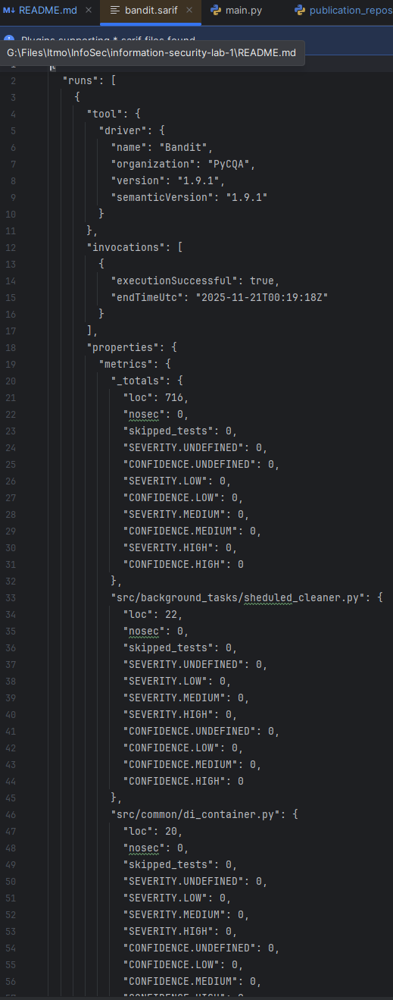
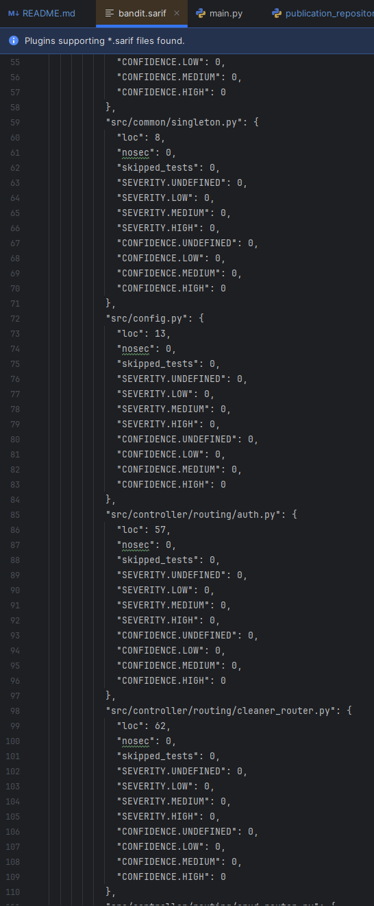
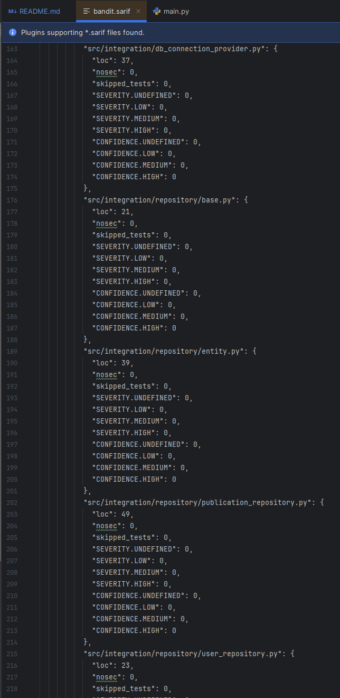
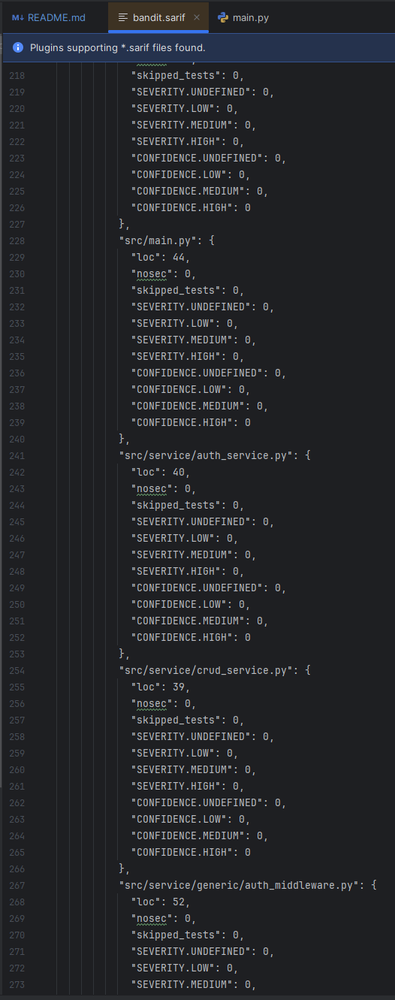
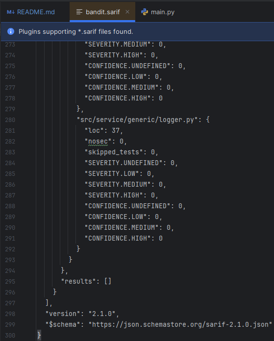
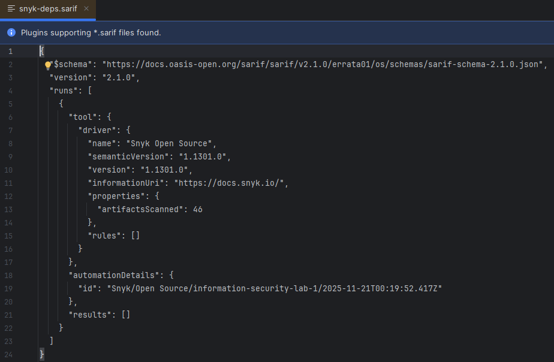

# information-security-lab-1

Лабораторная работа №1 по "Информационной безопасности" - Разработка защищенного REST API с интеграцией в CI/CD

## Стек проекта

Язык: `Python`/`FastAPI`

Менеджер пакетов: `poetry`

## Разработанный API

Подробная openapi документация доступна по `/redoc` или `/docs`

### Регистрация - `POST /auth/register`

```bash
curl -X 'POST' \
  'http://127.0.0.1:8000/auth/register' \
  -H 'accept: application/json' \
  -H 'Content-Type: application/json' \
  -d '{
  "login": "string",
  "password": "string"
}'
```

### Авторизация `POST /auth/login`

На вход принимает form-data, для авторизации через openapi

```bash
curl -X 'POST' \
  'http://127.0.0.1:8000/auth/login' \
  -H 'accept: application/json' \
  -H 'Content-Type: application/x-www-form-urlencoded' \
  -d 'grant_type=password&username=string&password=********&scope=&client_id=string&client_secret=********'
```

### `/api/data` - REST-ful endpoint-ы для CRUD операций да объектами Publication

#### `GET /api/data`

```bash
curl -X 'GET' \
  'http://127.0.0.1:8000/api/data/?limit=50&offset=0' \
  -H 'accept: application/json' \
  -H 'Authorization: Bearer '
```

#### `POST /api/data`

```bash
curl -X 'POST' \
  'http://127.0.0.1:8000/api/data/' \
  -H 'accept: application/json' \
  -H 'Authorization: Bearer ' \
  -H 'Content-Type: application/json' \
  -d '{
  "title": "string",
  "content": "string"
}'
```

#### `GET /api/data/{id}`

```bash
curl -X 'GET' \
  'http://127.0.0.1:8000/api/data/1' \
  -H 'accept: application/json' \
  -H 'Authorization: Bearer '
```

#### `PATCH /api/data/{id}`

```bash
curl -X 'PATCH' \
  'http://127.0.0.1:8000/api/data/1' \
  -H 'accept: application/json' \
  -H 'Authorization: Bearer ' \
  -H 'Content-Type: application/json' \
  -d '{
  "title": "string",
  "content": "string"
}'
```

#### `DELETE /api/data/{id}`

```bash
curl -X 'DELETE' \
  'http://127.0.0.1:8000/api/data/1' \
  -H 'accept: application/json' \
  -H 'Authorization: Bearer '
```

### `/cleaner` – RESTful endpoint-ы для управления фоновым процессом удаления старых публикаций

#### `GET /cleaner`

```bash
curl -X 'GET' \
  'http://127.0.0.1:8000/cleaner/' \
  -H 'accept: application/json' \
  -H 'Authorization: Bearer '
```

#### `POST /cleaner`

```bash
curl -X 'POST' \
  'http://127.0.0.1:8000/cleaner/' \
  -H 'accept: application/json' \
  -H 'Authorization: Bearer ' \
  -H 'Content-Type: application/json' \
  -d '{
  "interval_seconds": 3600,
  "cron": "0 * * * *"
}'
```

#### `DELETE /cleaner`

```bash
curl -X 'DELETE' \
  'http://127.0.0.1:8000/cleaner/' \
  -H 'accept: application/json' \
  -H 'Authorization: Bearer '
```

## Реализованные меры защиты

### Аутентификация на основе JWT токенов

Реализовано через библиотеку `pyjwt`.

```python
def create_access_token(subject: str, expires_delta: Optional[timedelta] = None) -> str:
    now = datetime.now(UTC)
    if expires_delta is None:
        expires_delta = timedelta(minutes=ACCESS_TOKEN_EXPIRE_MINUTES)
    expire = now + expires_delta
    payload = {
        "sub": str(subject),
        "iat": int(now.timestamp()),
        "exp": int(expire.timestamp()),
    }
    return jwt.encode(payload, SECRET_KEY, algorithm=ALGORITHM)


def get_user_id_from_token(token) -> Optional[str]:
    payload = jwt.decode(token, SECRET_KEY, algorithms=[ALGORITHM])
    return payload.get("sub")


class JWTAuthMiddleware(BaseHTTPMiddleware):
    def __init__(self, app, excluded_paths: list[str] | None = None):
        super().__init__(app)
        self.excluded_paths = excluded_paths or [
            AUTH_ROUTER_PREFIX,
            "/",
            "/healthcheck",
            "/open",
            "/docs",
            "/redoc",
            "/openapi.json",
        ]

    async def dispatch(self, request: Request, call_next: Callable):
        # Простой white-list: пропускаем Auth и docs
        path = request.url.path
        if any(path.startswith(p) for p in self.excluded_paths):
            return await call_next(request)

        auth_header = request.headers.get("Authorization")
        if not auth_header:
            return JSONResponse(
                {"detail": "Not authenticated"}, status_code=401, headers={"WWW-Authenticate": "Bearer"}
            )

        if not auth_header.startswith("Bearer "):
            return JSONResponse(
                {"detail": "Invalid auth header"}, status_code=401, headers={"WWW-Authenticate": "Bearer"}
            )

        token = auth_header.split(" ", 1)[1].strip()
        err_401 = JSONResponse(
            {"detail": "Could not validate credentials"}, status_code=401, headers={"WWW-Authenticate": "Bearer"}
        )
        try:
            user_str = get_user_id_from_token(token)
            if not user_str:
                return err_401
            user_id = int(user_str)
        except (PyJWTError, TypeError, ValueError):
            return err_401

        # Загрузим пользователя из БД
        async with di.pg_connection_provider.get_session() as session:
            user = await get_user_by_id(session, user_id)
            if not user:
                return JSONResponse(
                    {"detail": "User not found"}, status_code=401, headers={"WWW-Authenticate": "Bearer"}
                )

            # Положим пользователя в request.state чтобы handler-ы могли его достать
            request.state.user = user

        # Продолжим цепочку
        return await call_next(request)
```

### Хэширование паролей

Пароли хэшируются с помощью библиотеки `passlib` и алгоритма `argon2`.

```python
def get_password_hash(password: str) -> str:
    return pwd_context.hash(password)


def verify_password(plain_password: str, hashed_password: str) -> bool:
    return pwd_context.verify(plain_password, hashed_password)
```

### Защита от SQL-инъекций

Используется ORM `SQLAlchemy` с параметризованными запросами.

```python
class UserRepository:
    def __init__(
            self,
            session: Annotated[AsyncSession, Depends(di.get_pg_session)]
    ):
        self.session = session

    async def create_user(self, login: str, password_hash: str) -> User:
        user = User(login=login, password=password_hash)
        self.session.add(user)
        await self.session.commit()
        await self.session.refresh(user)
        return user

    async def get_user_by_login(self, login: str) -> Optional[User]:
        q = select(User).where(User.login == login)
        res = await self.session.execute(q)
        return res.scalars().first()
```

### Защита от XSS

Используются валидируемые схемы данных `Pydantic` как входных, так и выходных параметров

```python
class PublicationCreate(BaseModel):
    title: str = Field(..., max_length=255)
    content: str


class PublicationUpdate(BaseModel):
    title: Optional[str] = Field(None, max_length=255)
    content: Optional[str] = None


class PublicationOut(DatetimeBaseModel):
    id: int
    title: str
    content: str
    author_id: int
    created_at: Optional[datetime] = None
    updated_at: Optional[datetime] = None
```

## Отчёт bandit







## Отчёт snyk

